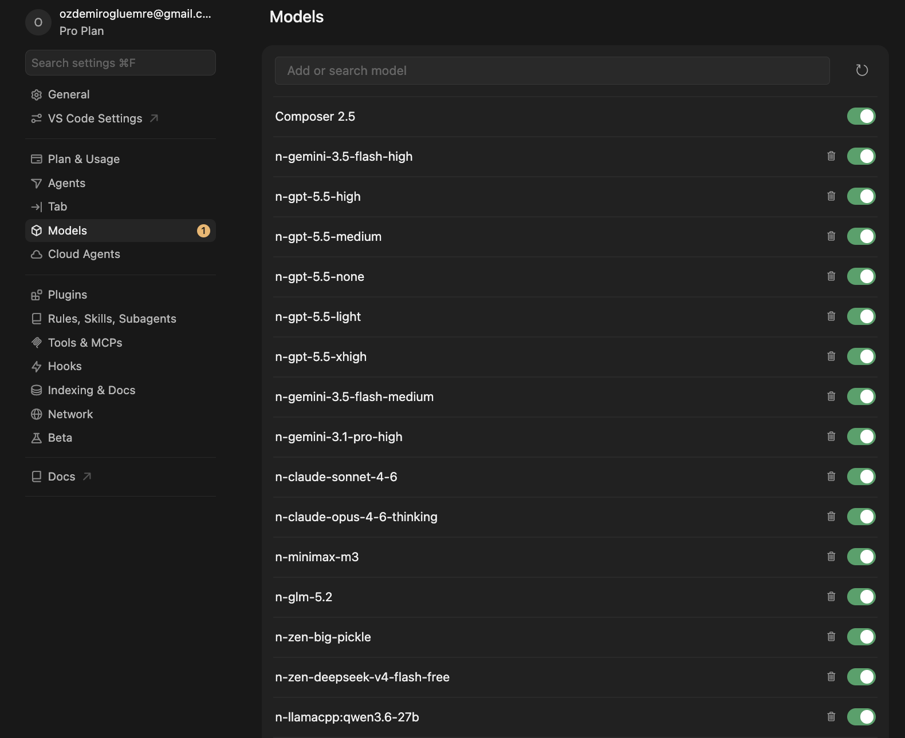

# 🍜 Cursor Instant Noodle

> **Cursor on an instant-noodle budget.**

A single OpenAI-compatible endpoint that plugs into Cursor and gives it access to **dozens of models from many different providers** — including ones Cursor doesn't ship, free models, and your own local server. Antigravity Gemini 3, Opencode Zen, z.ai GLM, MiniMax, Codex reasoning variants, Qwen on your RTX 3090 — all from the same Cursor dropdown.


## What you see in Cursor

After `cursor-noodle start`, the Models panel in Cursor fills up with custom models from every provider you've configured. **Every model ID starts with `n-`** (for noodle) so it never collides with Cursor's built-in names.



In the screenshot above (one account on each provider), the dropdown includes:

- **GPT-5.5 with 5 reasoning variants** — `n-gpt-5.5-none`, `n-gpt-5.5-light`, `n-gpt-5.5-medium`, `n-gpt-5.5-high`, `n-gpt-5.5-xhigh`. Cursor only ships the default; you can pick the exact reasoning depth for the task.
- **Gemini 3 Pro & 3.5 Flash** — `n-gemini-3.1-pro-high`, `n-gemini-3.5-flash-medium`, etc., routed through your free Antigravity Google account.
- **Claude Sonnet 4.6 / Opus 4.6** — `n-claude-sonnet-4-6`, `n-claude-opus-4-6-thinking` via Opencode Zen (one API key, not a separate Anthropic sub).
- **GLM-5.2 / GLM-4.6** — `n-glm-5.2`, `n-glm-4.6` via z.ai's flat-rate coding plan, or via Opencode Go with no Chinese card needed.
- **MiniMax-M3** — `n-minimax-m3` for fast cheap drafts.
- **Free models** — `n-zen-big-pickle`, `n-zen-deepseek-v4-flash-free`, `n-zen-mimo-v2.5-free` (no payment method, no rate-limit dance).
- **Local models** — `n-llamacpp:qwen3.6-27b` against your own server, no API key, no quota.

You can mix and match. A session can use Gemini 3 Pro for planning, Claude Opus for the hard refactor, GLM-5.2 for bulk edits, and your local 70B for the privacy-sensitive bits — without ever leaving Cursor.

## Architecture

```
Cursor ──► https://<random>.trycloudflare.com/v1
              │
              ▼ cloudflared tunnel (HTTPS)
          http://localhost:6767/v1 ──►  Antigravity  (Google OAuth, free)
                                         Codex      (ChatGPT OAuth, sticky failover)
                                         z.ai       (API key, sticky failover)
                                         MiniMax    (API key, sticky failover)
                                         Opencode   (Zen + Go, one API key)
                                         LMStudio / llama.cpp / Unsloth  (local)
```

The proxy is a thin Express server that:

- Receives an OpenAI Chat Completions request from Cursor
- Inspects the `model` field, looks at the `n-` prefix to pick a provider
- Translates to the provider's native format (only Antigravity and Codex need translation; the rest are passthroughs)
- Stitches the response back into OpenAI Chat Completions (or SSE) for Cursor

The full advertised model list lives in [lib/models.cjs](lib/models.cjs) and is served at `/v1/models`, so Cursor's dropdown populates automatically.

## Install

Requires Node.js 18+.

**Option A — npm (recommended):**

```bash
npm install -g cursor-instant-noodle
cursor-noodle        # first run opens the setup wizard
cursor-noodle start  # starts the proxy + public tunnel
```

Requires Node.js 18+. `npm` installs the package, its dependencies, and the `cursor-noodle` command on your PATH.

**Option B — standalone binary (no Node.js required):**

```bash
curl -fsSL https://raw.githubusercontent.com/EmreOzdemiroglu/cursor-instant-noodle/main/install.sh | bash
```

This downloads a prebuilt binary from the latest [GitHub release](https://github.com/EmreOzdemiroglu/cursor-instant-noodle/releases) to `~/.local/bin/cursor-noodle` and adds it to your PATH.

Either way, `cursor-noodle start` will download the `cloudflared` binary on first run so the public tunnel works out of the box. If that download fails (offline, rate-limited, corporate proxy), the local proxy still works — see [troubleshooting](docs/troubleshooting.md).

**Option C — from source (dev/contributing):**

```bash
git clone https://github.com/EmreOzdemiroglu/cursor-instant-noodle
cd cursor-instant-noodle
npm install
node bin/cursor-noodle.cjs start
```

> Note: `npm install -g github:owner/repo` (the GitHub shorthand) is currently unreliable on npm 11 — files end up missing from the install. Use Option A (`npm install -g cursor-instant-noodle` from the registry) or Option B (binary) instead.

## Connect Cursor

1. `Cmd + Shift + J` → **Models** → **OpenAI API**
2. Enable **Override OpenAI Base URL**
3. Paste the URL from `cursor-noodle status` (looks like `https://...trycloudflare.com/v1`)
4. API key: the `instant-noodle-xxxxxxxx` key printed by `cursor-noodle start` (also retrievable with `cursor-noodle key`)
5. Restart Cursor
6. Click **+ Add Custom Model** for each one you want. See the [model ID cheat sheet](docs/models.md#model-ids-to-add-in-cursor) for the full list.

## Highlights

- **Free models that actually work** — Gemini 3 Flash, GPT-OSS, GLM-4.6, MiniMax-M3, Zen free tier, all through one Cursor dropdown
- **GPT-5.5 with 5 reasoning variants** — `none` / `light` / `medium` / `high` / `xhigh` instead of Cursor's single default
- **Auto-routing** — model ID prefix decides the backend (`n-glm-*` → z.ai, `n-minimax-*` → MiniMax, `n-gemini-*` → Antigravity, etc.)
- **Drop-in OpenAI-compatible** — no Cursor plugin, just paste a base URL
- **Multi-account everywhere** — sticky failover across every provider so quota and rate limits don't break your flow
- **Hot-reload** — edit `~/.cursor-noodle/.env` and the proxy picks it up without a restart
- **🍜 One CLI** — `cursor-noodle start` runs everything (proxy + public tunnel) in the background

## API key

The proxy auto-generates an `instant-noodle-xxxxxxxx` API key on first run and stores it in `~/.cursor-noodle/.env`. The proxy rejects requests without a valid `Authorization: Bearer <key>` header (Cursor's model discovery endpoint is exempt so the dropdown can populate).

```bash
cursor-noodle key         # print the current key
cursor-noodle reset-key   # generate a new one (invalidates the old)
```

Regenerate the key if it ever leaks. The proxy hot-reloads new keys on `.env` change, so you don’t need to restart manually.

## Multi-account

Every multi-account provider (Opencode, z.ai, MiniMax, Codex, Antigravity) uses **sticky failover**: account 1 is used until it returns an auth/quota/rate failure, then account 2 is tried silently. The caller only sees an error after every account has been tried. This preserves backend cache affinity and matches the documented behavior in [docs/providers.md](docs/providers.md).

## Commands

```bash
cursor-noodle              # first run: setup wizard; later: starts the proxy
cursor-noodle cheapmf      # free-tier fast path (Opencode key → DeepSeek/MiMo/North free)
cursor-noodle start        # start proxy + tunnel in the background
cursor-noodle status       # running state + public tunnel URL
cursor-noodle models       # list all available models
cursor-noodle setup        # re-open the setup wizard
cursor-noodle restart      # reload after manual .env changes
cursor-noodle uninstall    # stop, remove global binary, optionally wipe ~/.cursor-noodle/
cursor-noodle --help       # see every command
```

Uninstall: `cursor-noodle uninstall` will ask whether to wipe `~/.cursor-noodle/` (API keys, OAuth tokens, logs) — keep it if you plan to reinstall later. Or run `npm uninstall -g cursor-instant-noodle` directly, or use the included `uninstall.sh`.

## How it works

1. The proxy starts an Express server on port `6767` (configurable via `PORT`)
2. Spawns a Cloudflare quick tunnel to expose it on a public HTTPS URL — Cursor requires a public base URL, `localhost` does not work
3. Each `/v1/chat/completions` request is dispatched to a provider based on the model ID prefix
4. Antigravity and Codex providers translate OpenAI Chat Completions → their native format
5. Everything else (z.ai, MiniMax, Opencode, local) is a thin OpenAI passthrough
6. The full model list is advertised at `/v1/models` so Cursor's dropdown fills up
7. The proxy hot-reloads when `~/.cursor-noodle/.env` changes (config edits don't interrupt your session)

See [docs/development.md](docs/development.md) for the architecture in detail.

## Documentation

- **[Why?](docs/why.md)** — the instant-noodle-budget story
- **[Providers](docs/providers.md)** — detailed provider reference
- **[Models](docs/models.md)** — full model list per provider
- **[Cursor setup](docs/cursor-setup.md)** — step-by-step with details
- **[Local models](docs/local.md)** — LMStudio / llama.cpp / Unsloth
- **[Troubleshooting](docs/troubleshooting.md)** — common issues + fixes
- **[Development](docs/development.md)** — build, release, contribute

## Compatibility

- macOS, Linux, Windows (via WSL2 recommended)
- Node.js 18+
- Cursor 0.40+

## Contributing

PRs welcome! See [docs/development.md](docs/development.md) for adding a new provider.

## License

[MIT](LICENSE)
